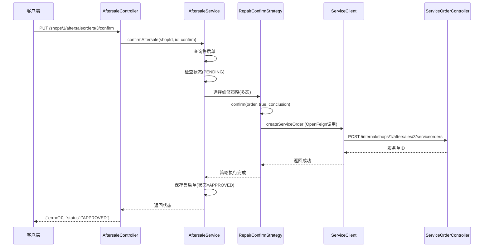
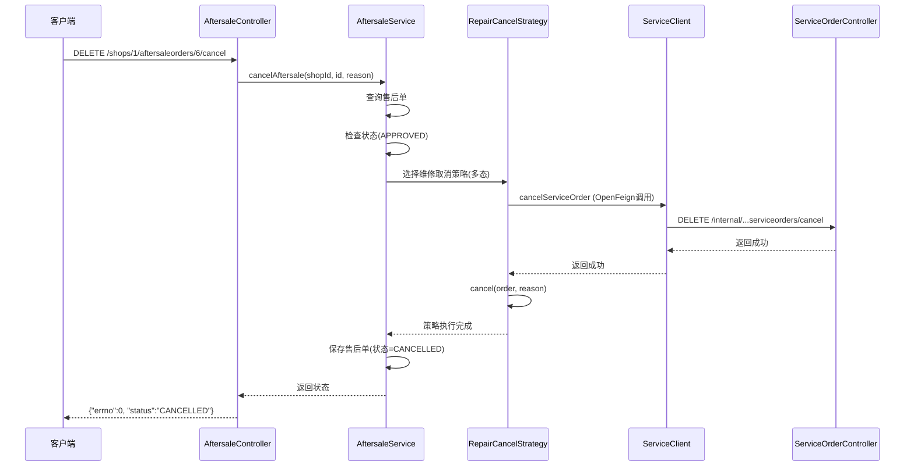

# 售后服务系统 - 架构设计文档

## 一、系统概述

本系统是一个基于**面向对象设计**和**策略模式**的售后和服务管理系统，展示了如何使用多态实现不同类型售后单的业务处理。

### 核心特性

- ✅ **策略模式**：不同类型售后单有不同的处理策略（退货、换货、维修）
- ✅ **DDD分层架构**：清晰的领域驱动设计
- ✅ **模块间通信**：基于OpenFeign的服务间调用
- ✅ **状态机模式**：严格的状态流转控制
- ✅ **面向对象设计**：充分利用封装、继承、多态

## 二、系统架构

### 2.1 模块划分

```
aftersale-service-system/
├── common/          # 公共模块（异常、返回值、工具类）
├── aftersale/       # 售后模块（端口8081）
├── service/         # 服务模块（端口8082）
└── sql/             # 数据库脚本
```

### 2.2 技术栈

| 技术 | 版本 | 用途 |
|------|------|------|
| Spring Boot | 3.2.5 | 基础框架 |
| Spring Cloud OpenFeign | 2023.0.1 | 服务间通信 |
| MyBatis | 3.0.3 | 数据访问 |
| MySQL | 8.0+ | 数据存储 |
| Druid | 1.2.27 | 连接池 |
| Lombok | 1.18.30 | 简化代码 |

## 三、核心设计模式

### 3.1 策略模式（Strategy Pattern）

#### 设计结构

```
AftersaleConfirmStrategy (策略接口)
├── ReturnConfirmStrategy     (退货策略)
├── ExchangeConfirmStrategy   (换货策略)
└── RepairConfirmStrategy     (维修策略)

AftersaleCancelStrategy (策略接口)
├── ReturnCancelStrategy      (退货取消)
├── ExchangeCancelStrategy    (换货取消)
└── RepairCancelStrategy      (维修取消)
```

#### 策略选择（多态核心）

```java
// 在AftersaleService中动态选择策略
AftersaleConfirmStrategy strategy = confirmStrategies.stream()
    .filter(s -> s.support(order.getType()))
    .findFirst()
    .orElseThrow();

// 执行策略（多态调用）
strategy.confirm(order, confirm, conclusion);
```

#### 三种策略的差异

| 策略类型 | 审核行为 | 取消行为 |
|---------|---------|---------|
| 退货 | 记录审核结果 | 取消售后单 |
| 换货 | 记录审核结果 + 准备新商品 | 取消售后单 + 释放库存 |
| 维修 | **调用service模块创建服务单** | **调用service模块取消服务单** |

### 3.2 类图设计

#### 售后模块核心类图

```
┌─────────────────────────┐
│  AftersaleOrder         │  领域对象
│─────────────────────────│
│ - id: Long              │
│ - type: Integer         │
│ - status: Status        │
│─────────────────────────│
│ + checkPendingStatus()  │
│ + approve()             │
│ + cancel()              │
└─────────────────────────┘
           ▲
           │ 依赖
           │
┌──────────────────────────┐
│ AftersaleConfirmStrategy │  策略接口
│──────────────────────────│
│ + confirm()              │
│ + support()              │
└──────────────────────────┘
           △
           │ 实现
    ┌──────┼──────┐
    │      │      │
┌───▼────┐ │  ┌───▼────┐
│ Return │ │  │ Repair │
│Strategy│ │  │Strategy│
└────────┘ │  └────────┘
       ┌───▼────┐
       │Exchange│
       │Strategy│
       └────────┘
```

## 四、业务流程

### 4.1 商户审核售后（维修场景）



### 4.2 商户取消售后（维修场景）



### 4.3 状态机设计

#### 售后单状态流转

```
    [创建]
      ↓
   PENDING (待审核)
      ↓
   APPROVED (已审核) ←─ 只有此状态才能取消
      ↓
   CANCELLED (已取消)
```

**状态约束**：
- PENDING → APPROVED：通过审核
- APPROVED → CANCELLED：取消售后
- **不允许**：PENDING → CANCELLED（必须先审核）

## 五、API设计

### 5.1 售后模块API

| API | 方法 | 路径 | 说明 |
|-----|------|------|------|
| 商户审核售后 | PUT | `/shops/{shopid}/aftersaleorders/{id}/confirm` | 根据类型执行不同策略 |
| 商户取消售后 | DELETE | `/shops/{shopid}/aftersaleorders/{id}/cancel` | 根据类型执行不同策略 |

### 5.2 服务模块API

| API | 方法 | 路径 | 说明 |
|-----|------|------|------|
| 审核服务商变更 | PUT | `/draft/{draftid}/review` | 平台管理员审核 |
| 创建服务单（内部） | POST | `/internal/shops/{shopId}/aftersales/{id}/serviceorders` | 被售后模块调用 |
| 取消服务单（内部） | DELETE | `/internal/shops/{shopId}/aftersales/{id}/serviceorders/cancel` | 被售后模块调用 |

## 六、数据库设计

### 6.1 aftersale_db

#### aftersale_order（售后单表）

| 字段 | 类型 | 说明 |
|------|------|------|
| id | BIGINT | 主键 |
| shop_id | BIGINT | 店铺ID |
| order_id | BIGINT | 订单ID |
| type | INT | 售后类型（0-退货 1-换货 2-维修） |
| status | VARCHAR(20) | 状态 |
| reason | VARCHAR(500) | 售后原因 |
| conclusion | VARCHAR(500) | 审核结论 |

### 6.2 service_db

#### service_provider_draft（服务商草稿表）

| 字段 | 类型 | 说明 |
|------|------|------|
| id | BIGINT | 主键 |
| service_provider_id | BIGINT | 服务商ID |
| provider_name | VARCHAR(100) | 服务商名称 |
| status | VARCHAR(20) | 状态 |
| opinion | VARCHAR(500) | 审核意见 |

#### service_order（服务单表）

| 字段 | 类型 | 说明 |
|------|------|------|
| id | BIGINT | 主键 |
| shop_id | BIGINT | 店铺ID |
| aftersales_id | BIGINT | 售后单ID |
| type | INT | 服务类型 |
| status | VARCHAR(20) | 状态 |

## 七、面向对象设计亮点

### 7.1 多态的应用

**示例1：策略选择**
```java
// 不需要if-else，通过多态自动匹配
strategy.confirm(order, confirm, conclusion);
```

**示例2：策略扩展**
```java
// 新增售后类型时，只需添加新的策略类，无需修改现有代码
@Component
public class RefundConfirmStrategy implements AftersaleConfirmStrategy {
    @Override
    public boolean support(Integer type) {
        return type == 3; // 新增退款类型
    }
}
```

### 7.2 单一职责原则

- `AftersaleOrder`：领域对象，只负责状态管理
- `Strategy`：策略类，只负责具体类型的业务逻辑
- `Repository`：数据访问，只负责持久化
- `Service`：服务编排，只负责流程控制

### 7.3 开闭原则

系统对扩展开放，对修改关闭：
- 新增售后类型：添加新策略类
- 新增审核规则：在策略类中扩展
- 新增状态流转：在领域对象中扩展

## 八、测试指南

### 8.1 多态验证测试

```bash
# 测试1：验证退货策略
curl -X PUT http://localhost:8081/shops/1/aftersaleorders/1/confirm \
  -H "Content-Type: application/json" \
  -d '{"confirm": true, "conclusion": "同意退货"}'
# 观察日志：应输出 "执行退货审核策略"

# 测试2：验证维修策略（会跨模块调用）
curl -X PUT http://localhost:8081/shops/1/aftersaleorders/3/confirm \
  -H "Content-Type: application/json" \
  -d '{"confirm": true, "conclusion": "同意维修"}'
# 观察日志：应输出 "执行维修审核策略" + "创建服务单"
```

### 8.2 状态机测试

```bash
# 测试：已审核状态无法再次审核
curl -X PUT http://localhost:8081/shops/1/aftersaleorders/4/confirm \
  -H "Content-Type: application/json" \
  -d '{"confirm": true, "conclusion": "测试"}'
# 预期：返回错误 "只有待审核状态的售后单才能进行审核"
```

## 九、扩展建议

### 9.1 可扩展点

1. **新增售后类型**：实现新的Strategy类
2. **审核流程**：添加多级审核
3. **通知机制**：审核结果通知客户
4. **物流对接**：退货/换货物流单生成

### 9.2 性能优化

1. 添加Redis缓存售后单信息
2. 异步处理服务单创建
3. 使用消息队列解耦模块间通信

## 十、总结

本系统通过**策略模式**实现了售后单处理的多态设计，展示了：

1. ✅ **面向对象三大特性**：封装（领域对象）、继承（策略接口）、多态（策略选择）
2. ✅ **设计模式应用**：策略模式、状态机模式
3. ✅ **DDD分层架构**：清晰的领域模型和业务逻辑分离
4. ✅ **微服务通信**：OpenFeign实现跨模块调用
5. ✅ **可扩展性**：符合开闭原则，易于扩展新类型

这是一个**教科书级别**的面向对象设计示例！

